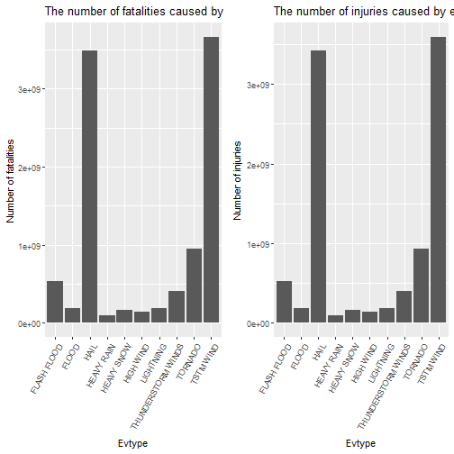
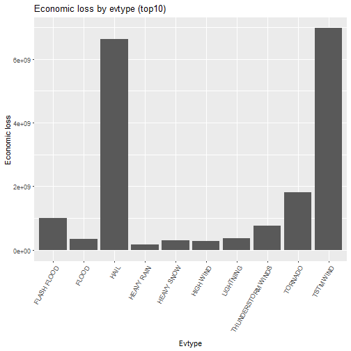

# The report is to explore the helth impackts and economic of US weather events between 1950 and 2011

## Synopsis
The analysis report is to explore the NOAA storm database and answer some basic questions about servere weather events. We first preprocessing the obtained data download from [raw data](https://d396qusza40orc.cloudfront.net/repdata%2Fdata%2FStormData.csv.bz2). The data shows that the greated harm impack and economic loss are caused by event type. In our data analysis, we try to replace the missing values with 0. And finally, we found that, "TSTM WIND" are most harmful impact to population health. And "TSTM WIND" is also has the greatest economic consequences.  

And we try to anwser the questions below:  
  
1.Across the United States, which types of events(as indicated in the EVTYPE variable) are most harmful with respec to population health?  
2.Across the Unique States, which types of events have the greatest economic consequences?

## Data Preprocessing

#### Load the libraries

```r
library(dplyr)
library(ggplot2)
library(readr)
library(ggpubr)
```

#### Download the data

```r
if (!file.exists("./data")) dir.create("./data")

if (!file.exists("./data/StormData.csv.bz2")) {
    data_url <- "https://d396qusza40orc.cloudfront.net/repdata%2Fdata%2FStormData.csv.bz2"
    download.file(data_url, destfile = "./data/StormData.csv.bz2", mode = "wb")
}
```

#### Read the data

```r
if (!exists("dat_raw")) {
    dat_raw <- read.csv("./data/StormData.csv.bz2",
                        header = TRUE)
}
```

#### Change the names of dat_raw from uppercase to lowercase

```r
lower_names <- gsub("(.*)", "\\L\\1", names(dat_raw), perl = TRUE)
names(dat_raw) <- lower_names
# check names of dat_raw
names(dat_raw)
```

```
##  [1] "state__"    "bgn_date"   "bgn_time"   "time_zone"  "county"    
##  [6] "countyname" "state"      "evtype"     "bgn_range"  "bgn_azi"   
## [11] "bgn_locati" "end_date"   "end_time"   "county_end" "countyendn"
## [16] "end_range"  "end_azi"    "end_locati" "length"     "width"     
## [21] "f"          "mag"        "fatalities" "injuries"   "propdmg"   
## [26] "propdmgexp" "cropdmg"    "cropdmgexp" "wfo"        "stateoffic"
## [31] "zonenames"  "latitude"   "longitude"  "latitude_e" "longitude_"
## [36] "remarks"    "refnum"
```

#### Extract the useful data from dat_raw, contains c("evtype", "fatalities", "injuries", "propdmg", "cropdmg")

```r
dat_useful <- dat_raw[, c("evtype", 
                          "fatalities", 
                          "injuries", 
                          "propdmg",
                          "cropdmg")]
```

#### Change the class of columns c("fatalities", "injuries", "propdmg", "cropdmg") to numeric

```r
dat_useful$fatalities <- as.numeric(dat_useful$fatalities)
dat_useful$injuries <- as.numeric(dat_useful$injuries)
dat_useful$propdmg <- as.numeric(dat_useful$propdmg)
dat_useful$cropdmg <- as.numeric(dat_useful$cropdmg)
```

#### replace the missing values by 0

```r
index_fatal_na <- which(is.na(dat_useful$fatalities))
index_injur_na <- which(is.na(dat_useful$injuries))
index_propdmg_na <- which(is.na(dat_useful$propdmg))
index_cropdmg_na <- which(is.na(dat_useful$cropdmg))

dat_useful$fatalities[index_fatal_na] <- 0.
dat_useful$injuries[index_injur_na] <- 0.
dat_useful$propdmg[index_propdmg_na] <- 0.
dat_useful$cropdmg[index_cropdmg_na] <- 0.
```

#### Prepare the health hurmful data to answer question 1

#### Prepare fatalities data, we extract the top 10 datas

```r
dat_fatal_by_evtype <- aggregate(dat_useful$fatalities ~ dat_useful$evtype,
                                 dat_useful, 
                                 sum)

names(dat_fatal_by_evtype) <- c("evtype", "fatalities")

dat_fatal_by_evtype <- dat_fatal_by_evtype[order(dat_fatal_by_evtype[, 2],
                                                 decreasing = TRUE),]

# extract the top 10 fatal data
top_10_fatal <- top_n(dat_fatal_by_evtype, 10, wt = dat_fatal_by_evtype[, 2])
```

#### Preapare injuries data

```r
dat_injur_by_evtype <- aggregate(dat_useful$injuries ~ dat_useful$evtype,
                                 dat_useful, 
                                 sum)

names(dat_injur_by_evtype) <- c("evtype", "injuries")

dat_injur_by_evtype <- dat_injur_by_evtype[order(dat_injur_by_evtype[, 2],
                                                 decreasing = TRUE),]

top_10_injur <- top_n(dat_injur_by_evtype, 10, wt = dat_injur_by_evtype[, 2])
```

#### Prepare the economic loss data to answer question 2

```r
dat_useful$eco_loss <- dat_useful$propdmg + dat_useful$cropdmg

dat_eco_by_evtype <- aggregate(dat_useful$eco_loss ~ dat_useful$evtype,
                               dat_useful, 
                               sum)

names(dat_eco_by_evtype) <- c("evtype", "eco_loss")

dat_eco_by_evtype <- dat_eco_by_evtype[order(dat_eco_by_evtype[, 2],
                                             decreasing = TRUE),]

top_10_eco <- top_n(dat_eco_by_evtype, 10, wt = dat_eco_by_evtype[, 2])
```


```r
head(top_10_fatal)
```

```
##               evtype fatalities
## 1          TSTM WIND 3662292239
## 2               HAIL 3489157210
## 3            TORNADO  950774290
## 4        FLASH FLOOD  529405439
## 5 THUNDERSTORM WINDS  401908428
## 6          LIGHTNING  192050763
```

```r
head(top_10_injur)
```

```
##               evtype   injuries
## 1          TSTM WIND 3592076894
## 2               HAIL 3421724779
## 3            TORNADO  934260411
## 4        FLASH FLOOD  519156191
## 5 THUNDERSTORM WINDS  394216207
## 6          LIGHTNING  188752999
```

```r
head(top_10_eco)
```

```
##               evtype   eco_loss
## 1          TSTM WIND 6965481248
## 2               HAIL 6617846819
## 3            TORNADO 1819655784
## 4        FLASH FLOOD 1010000601
## 5 THUNDERSTORM WINDS  769645173
## 6          LIGHTNING  367524736
```

## Results

#### Result to answer question 1

```r
plot_fatal <- ggplot(top_10_fatal, aes(x = evtype, y = fatalities)) +
    geom_bar(stat='identity', position="dodge") +
    ggtitle("The number of fatalities caused by evtypes") +
    theme(axis.text.x = element_text(angle=60, hjust=1)) +
    labs(x = "Evtype", y = "Number of fatalities")

plot_injur <- ggplot(top_10_injur, aes(x = evtype, y = injuries)) +
    geom_bar(stat='identity', position="dodge") +
    ggtitle("The number of injuries caused by evtypes") +
    theme(axis.text.x = element_text(angle=60, hjust=1)) +
    labs(x = "Evtype", y = "Number of injuries")

ggarrange(plot_fatal, plot_injur)
```



From the plot, we can see "TSTM WIND" are most harmful impact to population health.

#### Result to answer question 2

```r
plot_eco <- ggplot(top_10_eco, aes(x = evtype, y = eco_loss)) +
    geom_bar(stat="identity", position="dodge") +
    ggtitle("Economic loss by evtype (top10)") +
    theme(axis.text.x = element_text(angle=60, hjust=1)) +
    labs(x = "Evtype", y = "Economic loss")

print (plot_eco)
```



From the plot, we can see "TSTM WIND" are most harmful impact to population health, followed by "HAIL" and "TORNADO"
